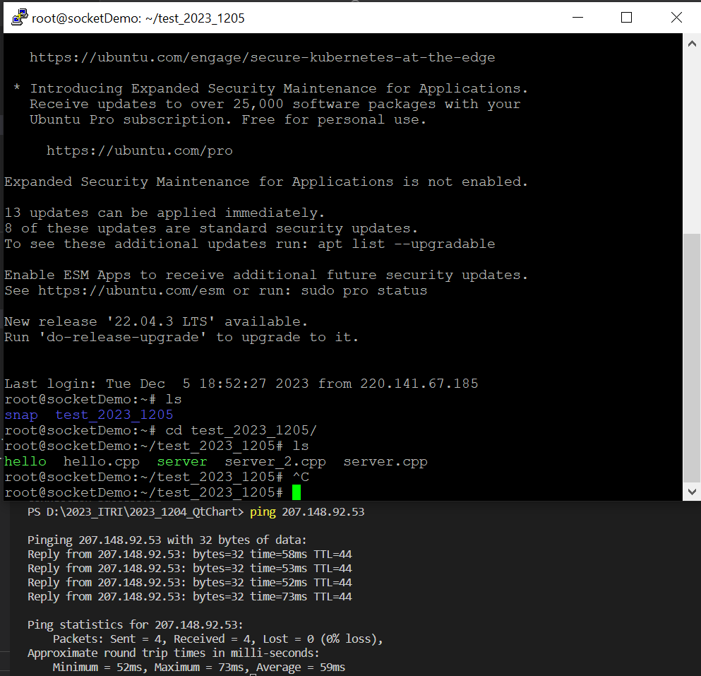

# tcp-sockets-cpp-ubuntu
(Still in progress) Trying to build up a chat application leveraging TCP sockets with C++ and Ubuntu

----
#### Progress Now: Learning multithreading and synchronization techniques regarding building a chat application
----

- (1) Refer to the techinical articles:

[Hands-On Multithreading with C++ 02—Synchronization](https://yc-kuo.medium.com/hands-on-multithreading-with-c-02-synchronization-534ba1fb31e3)

[Hands-On Multithreading with C++ 01—Overview](https://yc-kuo.medium.com/hands-on-multithreading-with-c-01-overview-e29087ebeadb)

[Hands-On TCP Sockets with C++ & Vim on Ubuntu](https://yc-kuo.medium.com/hands-on-tcp-sockets-with-c-vim-on-ubuntu-0bee398abb94)

 

- (2) Result so far

  

